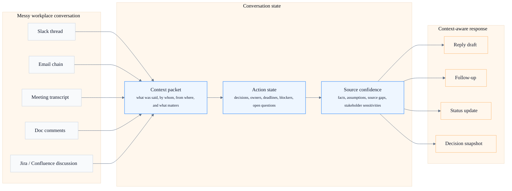

# ai-business-skills

Paste a messy thread or notes; get the clean ask, decision, owner, risk, and reply.

Use it when a Slack thread, email chain, meeting transcript, doc comment, Jira discussion, or project conversation contains signal, but not yet a clean ask, decision, owner, update, or follow-up.

## Use It When...

- A Slack thread, email chain, or meeting transcript needs a fast catch-up
- Someone asked a vague question and you need to clarify the ask
- A conversation has decisions, owners, deadlines, blockers, or open loops
- You need to draft the next context-aware reply
- You need to brief other people on what changed

## Try This First

Paste messy notes, a transcript, or connected context into Claude/Cowork and ask:

```text
Use brief-me. Catch me up on what changed, what needs my response, risks/blockers, and suggested follow-ups.
```

Tiny example:

```text
Messy input: "Can someone send thoughts on this Slack thread?"
What it needs: clean ask
What it needs: owner, risk, reply
Clean output: "We need a decision by Friday; owner is missing."
Reply: "Can we confirm the owner and the Friday decision?"
Full version: [examples/messy-thread-to-follow-up.md](examples/messy-thread-to-follow-up.md)
```

Shareable one-pager: [docs/one-pager.md](docs/one-pager.md)

## Privacy and control

- pasted-only mode uses only pasted text
- connected-context mode reads only approved tools
- draft-only mode does not send or publish
- action mode mutates systems only when explicitly asked
- Tone safety: helps avoid accidental escalation, fake certainty, overcommitment, and misreading stakeholder sensitivity

## What This Is

This repo is for the work before the work:

- understand what people said
- identify what changed
- separate facts from assumptions
- clarify the ask
- preserve open loops
- draft the next context-aware response

## What This Is Not

This is not a deck generator, project-management framework, or heavy artifact factory.



## Workflows

| Workflow | User question | Skill |
| --- | --- | --- |
| Catch up | What did I miss? | `brief-me` |
| Clarify | What are they actually asking? | `clear-ask` |
| Extract actions | What are the actions and open loops? | `meeting-to-actions` |
| Decide | What decision is needed? | `decision-brief` |
| Respond | What should I say back? | `follow-up-draft` |
| Broadcast | What should others know? | `status-update` |

## Meeting without a meeting

Many workplace meetings do not happen in Zoom.

A Slack thread, Gmail chain, Google Doc comment thread, Jira discussion, or Confluence page can contain the same things a live meeting does:

- decisions
- objections
- owner changes
- implied deadlines
- unresolved questions
- stakeholder sensitivities
- political or contextual tone

These skills process async conversations the same way you would process a meeting: extract state, identify open loops, and draft the next context-aware response.

## Operating Modes

Choose the mode that gives you the right control.

| Mode | You control |
| --- | --- |
| Pasted-only mode | Use only text you pasted |
| Connected-context mode | Read approved tools like Gmail, Slack, Calendar, Docs, Jira, or Confluence |
| Draft-only mode | Produce messages, updates, or follow-ups without sending or publishing |
| Action mode | Mutate systems only when you explicitly ask |

## Supported Context

Use pasted notes, Zoom transcripts, Slack, Gmail, Calendar, Atlassian, and Hex or other data outputs as inputs.

By default, these skills read and draft. They do not send messages, create events, update tickets, or publish outputs unless you explicitly ask.

Shared guidance for mixed-source inputs lives in [source-packet.md](references/source-packet.md).

## Examples

- [Messy thread to follow-up](examples/messy-thread-to-follow-up.md)
- [Morning brief](examples/morning-brief.md)
- [Post-meeting follow-up](examples/post-meeting-follow-up.md)
- [Decision with data](examples/decision-with-data.md)
- [Leadership status update](examples/leadership-status-update.md)
- [Async Slack clear ask](examples/async-slack-clear-ask.md)
- [Gmail buried obligation](examples/gmail-buried-obligation.md)

## Keep It Practical

Every skill is designed to produce something you can send, decide from, or act on within 5 minutes.

Helpful supporting files:

- [clarity-check.md](checklists/clarity-check.md)
- [source-packet.md](references/source-packet.md)
- [CONVERSATION_STATE.md](templates/CONVERSATION_STATE.md)
- [ACTIONS.md](templates/ACTIONS.md)
- [DECISIONS.md](templates/DECISIONS.md)
- [UPDATE.md](templates/UPDATE.md)

## How This Repo Was Built

This repo was built using `ai-engineering-skills` as the control layer.

- [BUILD_LOG.md](docs/BUILD_LOG.md)
- [CREATION_INVOCATIONS.md](docs/CREATION_INVOCATIONS.md)
- [DESIGN_DECISIONS.md](docs/DESIGN_DECISIONS.md)
- [VERIFY.md](docs/VERIFY.md)
