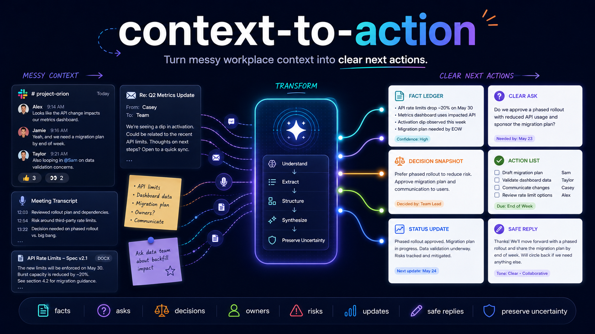

# context-to-action-skills

[](https://github.com/tmusser/context-to-action-skills/actions/workflows/validate.yml)
[](LICENSE)



Formerly `ai-business-skills`.

context-to-action-skills is the action layer for messy workplace context.

Most AI tools summarize context. This repo turns context into action while preserving uncertainty.

## What it does in 30 seconds

| Messy context | Clean output |
| --- | --- |
| A Slack thread with disagreement, legal uncertainty, support readiness risk, a 3pm deadline, and no named decision owner | Clean ask, decision needed, owner gap, risk/tone note, and a reply draft you can paste |

The promise is small: turn messy workplace context into the next clear move without pretending uncertainty is resolved.

## Start here

This repo is a lightweight skill pack for pasted workplace context.

It is not a deterministic workflow engine, ticketing system, MCP server, or project-management backend.

The skills provide reusable instruction contracts and examples. They help an assistant preserve uncertainty, identify asks, surface owners, draft replies, and avoid unsafe action.

Slack threads, email chains, doc comments, tickets, and transcripts can all carry the same source state as a live meeting. Treat them as async collaboration: extract facts first, then move to the next clear action.

For machine-validated workflows, use the optional schemas and examples as a stricter handoff layer.

## Try it in 60 seconds

No coding is required.

```sh
git clone https://github.com/tmusser/context-to-action-skills.git
cd context-to-action-skills
./install.sh --claude-user --only reduce-to-facts,clear-ask,decision-brief,follow-up-draft
./install.sh --codex-user --only reduce-to-facts,clear-ask,decision-brief,follow-up-draft
```

Start with `reduce-to-facts`; it is the safest first move for dense or ambiguous context. `clear-ask`, `decision-brief`, and `follow-up-draft` turn the ledger into action, and the full set adds `brief-me`, `meeting-to-actions`, and `status-update`. `--include-templates` is optional if you also want the supporting templates. Use `--force` only when you intentionally want to replace an existing destination that differs.

Paste messy notes, a transcript, or connected context into Claude/Cowork and ask:

```text
Use reduce-to-facts on this thread and give me a compact fact ledger with source scope, atomic facts, open questions, and action-relevant implications.
```

`reduce-to-facts` defaults to source-only mode. Ask for source-expanded mode only when you want outside evidence checked; it adds a Claim Status table and Rhetorical Leaps.

Tiny example:

```text
Messy input:
Alex: "Can we still send the customer note today?"
Sam: "I'd rather not wait; support can catch up after."
Priya: "Support needs the enterprise wording before anything goes out."
Jordan: "Legal has not approved the banner copy yet."
Alex: "The send queue closes at 3pm. Who owns the call?"

Clean output:
Clean ask: decide whether to send today or wait for legal/support readiness.
Decision needed: send today vs. move to tomorrow.
Owner gap: no final decision owner is named.
Suggested reply: "Can we name the decision owner and confirm by 3pm whether legal/support readiness blocks today's send?"
Full version: [examples/messy-thread-to-follow-up.md](examples/messy-thread-to-follow-up.md)
```

Shareable one-pager: [docs/one-pager.md](docs/one-pager.md)

## What it creates

The output here is a fact ledger, a reply draft, a status update, or a decision snapshot that preserves uncertainty.

It is not a deck generator, project-management framework, or heavy artifact factory.

The skills provide reusable instruction contracts and examples. They help an assistant preserve uncertainty, identify asks, surface owners, draft replies, and avoid unsafe action. They do not guarantee structured output unless the host assistant follows the requested format.

| Input | State extracted | Output |
| --- | --- | --- |
| Dense context, long thread, memo, policy doc, vendor writeup, or transcript | Facts you can rely on, plus opinions, unsupported claims, contradictions, open questions, and implications | `reduce-to-facts` fact ledger you can pass downstream |
| Slack thread, email chain, meeting transcript, doc comment, or Jira/Confluence discussion | What changed, clean ask, decision, owner, deadline, blocker, source confidence, and tone risk | Reply draft, follow-up, status update, decision snapshot, or action list |

Optional schemas and examples give you a stricter handoff layer when you want machine-checked output.

## What you can do

| Need | Ask | Skill |
| --- | --- | --- |
| Reduce dense context safely | What can I safely rely on? | `reduce-to-facts` |
| Catch up on a thread | What did I miss? | `brief-me` |
| Clarify what someone is asking | What are they actually asking? | `clear-ask` |
| Extract actions and open loops | What are the actions and open loops? | `meeting-to-actions` |
| Prepare a decision snapshot | What decision is needed? | `decision-brief` |
| Draft the next reply | What should I say back? | `follow-up-draft` |
| Brief others on what changed | What should others know? | `status-update` |

## Operating modes

Choose the mode that gives you the right control.

| Mode | You control |
| --- | --- |
| Pasted-only mode | Use only text you pasted |
| Connected-context mode | Read approved tools like Gmail, Slack, Calendar, Docs, Jira, or Confluence |
| Draft-only mode | Produce messages, updates, or follow-ups without sending or publishing |
| Action mode | Mutate systems only when you explicitly ask |

## Compatibility and control matrix

| Mode | What it uses | Default behavior | Validation confidence | Caveat |
| --- | --- | --- | --- | --- |
| Pasted-context mode | Pasted notes, transcripts, docs, or thread text | Read and draft from pasted source only | High | This is the primary validated usage pattern. |
| Claude/Cowork-style skills | Local `SKILL.md` files plus pasted context | Read and draft through the hosted skill pack | Medium | Validated mainly when used with pasted context; host UI behavior is outside this repo. |
| Codex install path | `install.sh` or copied skill folders | Places the same skill pack in Codex-friendly paths | Medium | Install layout is validated; host features are not. |
| Other assistants / manual prompt reuse | Copied `SKILL.md` text or pasted prompts | Same output contract when the host follows it | Low | Compatibility target, not a tested integration. |
| Connected-context mode | Approved tools the user explicitly authorizes | Reads only approved tools | Low | This repo does not grant connector access. |
| Action mode | Host tool invocation plus user approval | Mutates systems only when explicitly asked | Low | This repo provides guardrails, not mutation rights. |

## Validation boundary

This is the pasted-context validation boundary for the repo.

The validated path is pasted-context usage with Claude/Cowork-style skills.

The `SKILL.md` files are plain text and may be adapted for ChatGPT, Gemini, Codex-style agents, or internal assistants, but those paths are compatibility targets rather than fully tested integrations.

Connector and action-mode behavior depends on the host assistant and the tools the user explicitly authorizes. This repo provides guardrails and output contracts; it does not independently grant tool access or mutate systems unless explicitly asked.

For why MCP stays out of scope for now, see [integration roadmap](docs/integration-roadmap.md).

Shared guidance for mixed-source inputs lives in [source-packet.md](references/source-packet.md).

## Privacy and control

- pasted-only mode uses only pasted text
- connected-context mode reads only approved tools
- draft-only mode does not send or publish
- action mode mutates systems only when explicitly asked
- Tone safety: helps avoid accidental escalation, fake certainty, overcommitment, and misreading stakeholder sensitivity

## Examples

- [Reduce to facts vendor risk](examples/reduce-to-facts-vendor-risk.md)
- [Reduce to facts source expanded](examples/reduce-to-facts-source-expanded.md)
- [Messy thread to follow-up](examples/messy-thread-to-follow-up.md)
- [Gmail buried obligation](examples/gmail-buried-obligation.md)
- [Leadership status update](examples/leadership-status-update.md)
- [Post-meeting follow-up](examples/post-meeting-follow-up.md)
- [Morning brief](examples/morning-brief.md)
- [Decision with data](examples/decision-with-data.md)
- [Async Slack clear ask](examples/async-slack-clear-ask.md)

See [examples/README.md](examples/README.md) for a quick index of what each example demonstrates.

Helpful supporting files: [clarity-check.md](checklists/clarity-check.md), [source-packet.md](references/source-packet.md), [CONVERSATION_STATE.md](templates/CONVERSATION_STATE.md), [ACTIONS.md](templates/ACTIONS.md), [DECISIONS.md](templates/DECISIONS.md), and [UPDATE.md](templates/UPDATE.md).

## How This Repo Was Built

This repo was built using `ai-engineering-skills` as the control layer.

- [BUILD_LOG.md](docs/BUILD_LOG.md)
- [CREATION_INVOCATIONS.md](docs/CREATION_INVOCATIONS.md)
- [DESIGN_DECISIONS.md](docs/DESIGN_DECISIONS.md)
- [VERIFY.md](docs/VERIFY.md)
- [Process artifacts](docs/process/README.md)

## Part of the suite

This repo is one piece of a small set of repos for making AI-assisted work clearer, more bounded, and more verifiable. See [Suite map](docs/SUITE_MAP.md).
